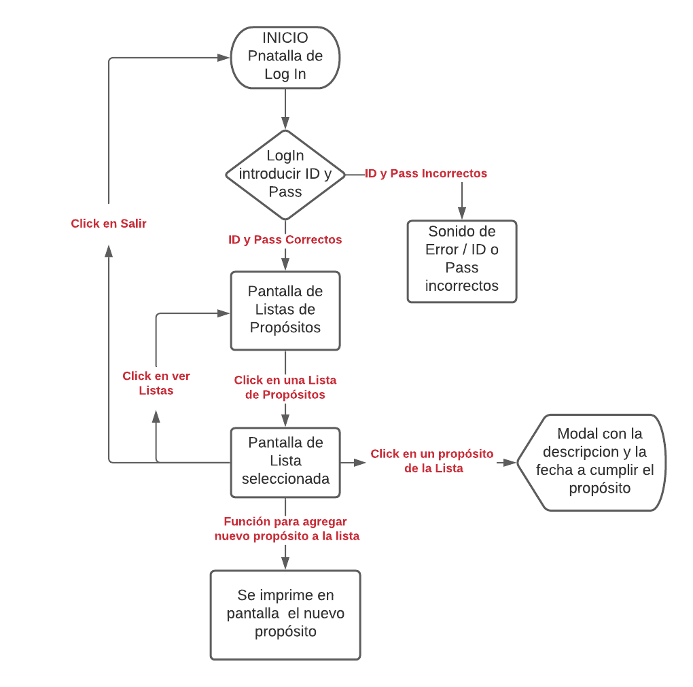
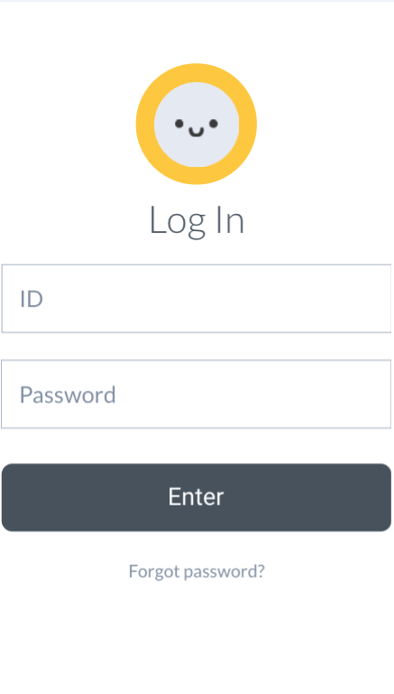
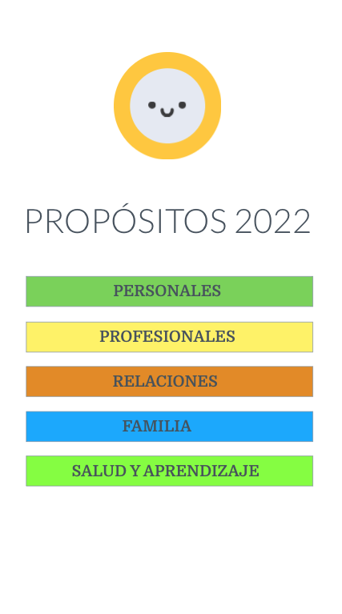
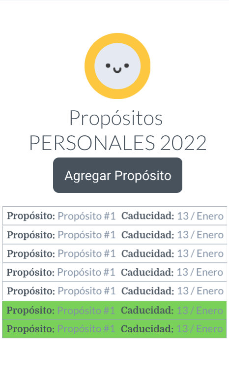

# Lista de Porósitos 2022
## Technical Challenge
---

1. Descripción 
2. Diagrama de Flujo
3. Bocetaje
4. Producto Final

---

## 1. Descripción

Aplicación web diseñada para correr desde el navegador en dispositivos móviles y de escritorio.
Esta aplicación nos permite crear una lista de proósitos de año nuevo, en donde se pueden:
- Seleccionar los tipos de propósitos: Personal, Profesional, Relaciones, Familia, Salud y Aprendizaje. 
- Añadir en una lista los propósitos y metas a cumplir en este nuevo año.
- Añadir una breve descripción al propósito.
- Añadir la fecha a cumplir el propósito.
- Permite marcar las metas ya cumplidas. 

---

## 2. Diagrama de Flujo 

- Diagrama de Flujo de pantallas
  

---

## 3. Bocetaje

- Primer pantalla: LogIn
  

- Segunda pantalla: Listas de Propósitos
  

- Tercer pantalla: Vista de la Lista de propósitos 
  
  
---

## 4. Producto Final

Link de la app: 
Id:
Pass: 

